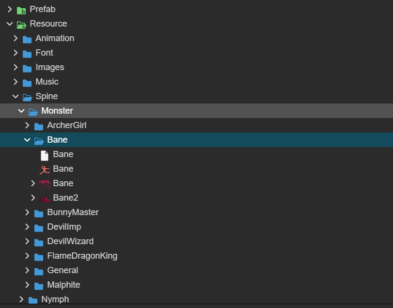

# Cocos 回合制游戏文档（代码v 1.0.1版本）

游戏目前包含装备系统，资源系统，战斗系统，技能系统，存储系统，成就系统，BUFF系统，剧情系统

注意: **下文 "根目录" 指的就是 "assets" 文件夹**

注意: **下载得到的文件夹为包含基础关卡，怪物和装备物品，若跟随此文档可以直接删除 "根目录/Script/Mod/Base"文件夹** 需要角色物品动画素材可以加群免费下载获取，动画素材本身为其他游戏中获取的所以不可商用只能用于学习交流。

更新内容: (v 1.0.0 -> v 1.0.1)[如果商城版本没有更新可能是还再审核中]

**更改了Mod文件夹代码目录格式 **

**v 1.0.0** Mod 文件夹格式


比较混乱，所有角色扩展，物品扩展文件夹都暴露在外

**v 1.0.1** Mod 文件夹格式


每个 Mod 自建一个文件夹，方便管理，可以直接删除或者添加

**自定义主页宠物**

## 目录结构


- Module **(第三方库文件)**
  - Axios **(前端http网络模块)**
  - CcNative **(Cocos本地功能封装)**
    - Asset **(资源管理)**
    - Storage **(本地存储)**
  - EventManager **(事件管理模块)**
  - Extension **(扩展模块)**
    - Component **(组件扩展)**
  - Rx **(响应式模块，源自Vue3源码，可以用来做发布订阅)**
    - reactivity **(响应式功能实现)**
    - shared **(共享模块)**

- Prefab **(预制体文件夹，可通过AssetManager类动态获取)**
  - MessageAlert **(消息展示预制体)**
  - UserResource **(用户资源展示预制体)**
- Resource **(资源文件夹，可通过AssetManager类动态获取)**
  - Animation **(动画Clip文件夹)**
  - Font **(字体文件夹)**
  - Images **(各种装备，物品，buff，角色的图标文件夹)**
  - Music **(音乐文件夹)**
  - Spine **(动画文件夹)**
  - Ui **(图标文件夹)**
- Scenes **(场景文件夹)**
- Script **(脚本文件夹，主要代码在这里)**
  - Component **(扩展组件)**
  - Data **(用户数据，游戏数据存储)**
  - Mod **(主要扩展代码，可以添加物品，装备，怪物，关卡...)**
  - Prefab **(对应 根目录/Prefab 文件夹下的所有预制体的脚本)**
  - Scenes **(场景组件)**
  - System **(游戏系统的实现)**
    - Base **(基本类)**
    - Caculate **(计算公式)**
    - Instance **(实例化的原型)**
    - Prototype **(基础原型)**
  - Util **(工具代码)**

## Module (第三方库模块)

提供一些常用的通用功能封装，用来简化功能开发，或者引入第三方库，亦或者进行某些通用扩展操作

### **Axios** (HTTP网络请求)

移植自Axios，具体用法可参考文档  [Axios中文文档](https://www.axios-http.cn/docs/intro) 目前web端完全可用，android，ios未测试

###  **Asset** (资源系统)

封装于cocos自带的AssetManager的资源管理API

#### CcAssetManager

该代码源文件位于 **根目录/Module/CcNative/Asset/AssetManager.ts**

AssetManager 构造函数的定义为

```typescript
class CcAssetManager {
    constructor(bundleName: string) {}
}
```

bundleName 为一个字符串参数，该字符串需要在编辑器中设置

​		

选择一个文件夹，勾选 isBundle，输入BundleName，之后可以通过BundleName获取该文件夹下的资源

可以直接通过导入 CcNative 使用

示例: 

```typescript
import { CcNative } from "根目录路径/Module/CcNative";
// 实例化 AssetManager 类
const assetManager = new CcNative.Asset.AssetManager("Resource")

// 初始化后无需等待即可以直接进行资源加载

// load用法与cocos原有AssetManager.load用法类似，返回一个Promise
assetManager.load("资源路径" , SpriteFrame/** 资源类型 **/) 
.then(res => {
    // 如果不出意外 res 就是需要的资源
    log(res)
}).catch(e => {
    log("资源不存在")
})

// loadDir用法也与AssetManager.loadDir类似，返回一个Promise
assetManager.loadDir("文件夹路径") 
.then(res => {
    // 如果不出意外 res 就是需要的资源数组
    log(res)
}).catch(e => {
    log("资源不存在")
})
```

使用 CcAssetManager 会对资源进行缓存操作，加速下一次获取，相邻两次获取同一个资源也会进行节流合并: 

```typescript
const assetPath = "临时路径"
const p1 = assetManager.load(assetPath)
const p2 = assetManager.load(assetPath)
log(p1 === p2) // true 实际上只会获取一次
```

#### RemoteAsset

该代码源文件位于 **根目录/Module/CcNative/Asset/RemoteAsset.ts**

它只提供一个函数 **loadRemote** ，用于加载远程资源，用法与 cocos **AssetManager.loadRemote** 用法相同

```typescript
import { CcNative } from "根目录路径/Module/CcNative";

CcNative.Asset.loadRemote("http://xxx" , null)
.then(res => {
    log(res) // 资源文件
})
```

### EventManager (事件管理)

用于进行事件订阅和发布

#### EventManagerClass

该代码源文件位于 **根目录/Module/CcNative/EventManager/index.ts**

EventManagerClass 的构造定义为: 

```typescript
// 构造定义
class EventManagerClass {
    constructor() {}
}
```

它提供了一个全局的 instance 实例

```typescript
import { EventManagerClass } from "根目录/Module/EventManager"

const event = EventManagerClass.instance
// 或者
// const event = new EventManagerClass

// 回调函数
const callback = () => {}

// 监听 type name 事件
// type name 为事件名称 callback 为对于回调函数 1 就是执行次数(-1为无限执行，1为只执行一次)
event.on("type name" , callback , 1)

// 移除监听
event.off("type name" , callback)

// 提交事件 可以传入参数给callback
event.emit("type name" , ...arguments)

// 清楚事件所有回调
event.clear("type name")
```

### Extension (扩展模块)

针对于Cocos进行扩展操作，目前是两个常用组件进行的扩展

#### Component 

对组件进行扩展，一般是通用扩展

##### ExtensionComponent

该代码源文件位于 **根目录/Module/Extension/Component/ExtensionComponent.ts**

扩展基础  **cc.Component ** 添加了两个功能性的函数 **effect** 和 **setAutoInterval**

示例: 

```typescript
import { Extension } from '../../../../Module/Extension';

export default class MyComponent extends Extension.ExtensionComponent {
    
    protected start(): void {
        // 和 Vue3 中的响应式 effect 用法一样
        // 扩展了 effect 函数，会在组件销毁时自动停止
        this.effect(() => {})
        // 扩展了定时器函数，会在组件销毁时自动停止
        this.setAutoInterval(() => {} , {
            count: 1, // 执行次数 1 为 1 次 ， -1 为无限次
            timer: 1000 // 执行间隔 单位 ms
        })
    }
    
}
```

##### SpineAnimation

该代码源文件位于 **根目录/Module/Extension/Component/SpineAnimation.ts**

扩展基础  **cc.sp.Skeleton** 添加了一个功能性的函数 **playAnimation** 用于播放spine动画

示例: 

```typescript
import { Extension } from '../../../../Module/Extension';

export default class MyComponent extends Extension.SpineAnimation {
    
    protected start(): void {
        // playAnimation 有两个次数 动画名称 播放次数(-1为循环播放)
        this.playAnimation("动画名称" , 1)
        // 返回 Promise 如果动画有播放次数限制，则到达次数后 Promise 成功
        .then(res => {
            log("动画播放完成")
        })
    }
    
}
```

### Rx (响应式模块)

移植自 Vue3 核心响应式模块，主要有 **reactive** 和 **effect** 两个函数组成

具体用法和原理参考 [Vue3 响应式原理解析](https://mp.weixin.qq.com/s?__biz=MzI3NTM5NDgzOA==&mid=2247483736&idx=1&sn=7ffba2b40fa0ddacd1ad0a34c4afad7d&chksm=eb043921dc73b037b637f83a9344f9ffb40f0c514cce6cb2de609093d20860c436cd4d307db8&token=431470234&lang=zh_CN#rd)

基础用法为:

```typescript
const {Rx} from "根目录/Module/Rx"

// data 为可响应对象
const data = Rx.reactive({
    count: 0
})

Rx.effect(() => {
    // 使用自动订阅 data.count 的改变
    log(data.count)
})

// 改变 data.count
setInterval(() => data.count++ , 1500)

// 以上代码的执行结果为
// 每隔 1.5s 会输出 count 的值
```


## Script (主要脚本文件夹)

这里着重介绍 **Mod** 和 **System** 文件夹，扩展主要在 **Mod** 文件夹中，会经常用到 **System** 文件夹的类和函数以及各种注册装饰器。这里会从创建一个一个物品，装备，关卡，怪物，buff，技能来讲解...

我们先创建一个自己的 Mod 文件夹，在 **根目录/Script/Mod** 下创建文件夹，命名为 **MyMod** ，下文中如果有不存在的目录直接创建即可。

### 自定义主页宠物(v1.0.1 以上版本)

游戏中主页宠物继承于最基础的原型类：PetDataClass 类，它位于 **根目录/Script/Data/PetData.ts** 文件 ，我们通过重写基类的方法和属性可以做到自定义Spine动画，说话的文字等...

假设我们现在有一套新的宠物Spine动画

[Spine动画](./README/Atelisi.zip)

我们新建一个文件夹名称为 **Atelisi** 放在 **根目录/Resource/Spine/Pet** 中，之后新建文件在 **根目录/Script/Mod/MyMod/Pet** 下，就命名为 **Atelisi.ts** 代码内容为:

```typescript
// 导入基类 和 注册装饰器
import { PetDataClass, RegisterPetData } from "../../../Data/PetData";

// 注册宠物数据
@RegisterPetData()
export class Atelisi extends PetDataClass {
    
    // 宠物动画文件夹
    public spine: string = "Spine/Pet/Atelisi"

    // 宠物动画名称
    public animation: string = "daiji"

    // 宠物缩放比例
    public scale: number = 0.5
    
    // 宠物的发言
    public text: string[] = [
        "你好,我叫爱丽丝，你受伤了吗，让我帮你治疗吧。",
        "蕾雅有时候是会比较严厉，那是她不愿意再失去战友了。"
    ]

}
```

之后，我们就可以在主页看见自己的宠物了。


### 自定义物品(v1.0.0 以上版本)

游戏中的所有物品继承于最基础的物品原型类：ItemPrototype 类，它位于 **根目录/Script/System/Prototype/ItemPrototype.ts** 文件 ，我们通过重写基类的方法和属性可以做到自定义图标，介绍，用法等...

#### 第一个自定义物品

假设我们现在有一个新的物品图标


我们将它命名为 **君焰石** 作为一个物品，图片命名为 **FlameEnhancementStone.png**

我们先将它放入资源文件夹中 **根目录/Resource/Images/Item** 下

之后我们新创建脚本，将它创建在 **根目录/Script/Mod/MyMod/Item** 下，就命名为 FlameEnhancementStone.ts

代码内容为: 

```typescript
// 从 System 文件夹中加载 ItemPrototype 基类 和 注册物品 的注解
import { ItemPrototype, RegisterItem } from "../../../System/Prototype/ItemPrototype"

// 注册物品原型，参数为物品id，这里物品类就会被收录到 ItemPrototype.AllItems 中,可以被遍历使用
@RegisterItem("FlameEnhancementStone")
// 继承 ItemPrototype 类
export class FlameEnhancementStone extends ItemPrototype {

    // 重写名称属性，游戏内显示的名称
    public name: string = "君焰石"

    // 游戏内的图标路径
    public icon: string = "Images/Item/FlameEnhancementStone/spriteFrame"

    // 是否可以使用，如果可以的话，游戏内会显示使用按钮
    public canUse: boolean = false

    // 游戏中的简介
    public description: string = "蕴含着火焰力量的神秘石头"

    // 构造器
    constructor() {
        // 必须将自己的类传给父类
        super(FlameEnhancementStone)
    }

    // 使用时的函数
    public use(num: number): void {
    }

}
```

然后，我们就可以在游戏中获得物品了，但是我们现在没有获取路径，所以让我们再加入一个物品，用来获取所有被注册的物品。

#### 第二个自定义物品

我们现在又有一个新的物品图标


我们将它命名为 **作弊道具** 作为一个物品，图片命名为 **CheatPack.png**

我们先将它放入资源文件夹中 **根目录/Resource/Images/Item** 下

之后我们新创建脚本，将它创建在 **根目录/Script/Mod/MyMod/Item** 下，就命名为 CheatPack.ts

代码内容为: 

```typescript
import { UserBagEquipments, UserEquipmentDTO } from "../../../Data/UserBagEquipments"
import { ItemDto, UserBagItems } from "../../../Data/UserBagItems"
import { EquipmentQuality } from "../../../System/Instance/Equipment"
import { EquipmentPrototype } from "../../../System/Prototype/EquipmentPrototype"
import { ItemPrototype, RegisterItem } from "../../../System/Prototype/ItemPrototype"
import { MessageAlert } from "../../../Util/MessageAlert"

// 注册物品
@RegisterItem("CheatPack")
export class CheatPack extends ItemPrototype {

    public name: string = "开发者作弊礼包"

    public icon: string = "Images/Item/CheatPack/spriteFrame"

    public canUse: boolean = true

    public description: string = "获得所有装备和物品"

    constructor() { 
        super(CheatPack)
    }

    // num 为 使用数量
    public use(num: number): void {
        // 获取所有注册的物品id
        const allItemConstroctor = Array.from(ItemPrototype.AllItems.keys())
        // 物品数据 ItemDto {id: string , count: number}
        let items: ItemDto[] = []
        // 循环使用
        for (let i = 0; i < num; i++) {
            // 遍历所有物品
            allItemConstroctor.forEach((key) => {
                // 避免重复添加本身物品
                if (key !== "CheatPack") {
                    // 通过 UserBagItems.addItem 函数将物品添加到用户数据中
                    const result = UserBagItems.addItem({id: key, count: 1000})
                    // 添加物品数据
                    items.push(result)
                }
            })
        }
        // 展示祝贺语
        MessageAlert.congratulationsGetRewards(items , [])
        // 保存用户数据到本地
        UserBagItems.saveInstance()
    }

}
```

### 通过代码添加物品到背包(v1.0.0 以上版本)

现在我们将该物品添加到用户初始物品栏中，来到文件 **根目录/Script/Data/UserBagItems.ts** 文件

在代码中添加

```typescript
export class UserBagItems {

    // ... 其余代码
    
    // 修改 items 赋予初始值 ， id为我们使用 RegisterItem 装饰器设置的id ，count 为数量
    public items: Array<ItemDto> = [{id: "CheatPack" , count: 99}];

}
```

至此，我们就可以在游戏中看到


物品就出现了。**如果您没有找到对应的物品，可能是您之前进入游戏已经保存过了，只需要清除浏览器缓存(locaStorage)重新进入游戏即可!!!**

这里我们就可以使用物品了，使用物品后，这个物品会遍历所有物品并且添加到背包中并弹出提示，之后就可以看到我们的君焰石了


至此，物品的添加就先告一段落了，你已经成功添加了两个自己的物品到你的游戏中了，接下来我们试试添加一个技能到游戏中吧。

### 添加一个自己的技能(v1.0.0 以上版本)

游戏中的所有技能继承于最基础的技能原型类：SkillPrototype 类，它位于 **根目录/Script/System/Prototype/SkillPrototype .ts** 文件 ，我们通过重写基类的方法和属性可以做到自定义图标，介绍，用法等...

#### 第一个自定义技能

假设我们现在有一个新的技能图标


我们将它命名为 **大治疗术** 作为一个物品，图片命名为 **Macrotherapy.png**

我们先将它放入资源文件夹中 **根目录/Resource/Images/Skill** 下

之后我们新创建脚本，将它创建在 **根目录/Script/Mod/MyMod/Skill** 下，就命名为 Macrotherapy.ts

代码内容为

```typescript
import { RegisterSkill, SkillPrototype } from '../../../System/Prototype/SkillPrototype';
import { RegisterPlayerSkill } from '../../../Data/UserSkillTree';
import { FightData } from '../../../System/Base/FightData';

// 全局注册技能
@RegisterSkill("Macrotherapy")
// 注册到玩家技能表
@RegisterPlayerSkill("Macrotherapy")
export class Macrotherapy extends SkillPrototype {

    // 游戏内显示的名称
    public name: string = "大治疗术"

    // 游戏内显示的图标
    public icon: string = "Images/Skill/Macrotherapy/spriteFrame"

    // 简介
    public get description(): string {
        return `治疗所有队友，恢复 ${
            this.getCure()
        }(${
            100 * this.getLv()
        }%魔力值 + ${
            50 * this.getLv()
        }) 的生命值 , 并获得 ${ 10 * this.getLv() } 的双抗`
    }

    // 冷却时间，单位为秒
    public get time(): number {
        return 12 - Math.min(this.getLv() , 5)
    }

    // 消耗魔力值
    public get cost(): number {
        return 20 + (10 * this.getLv())
    }

    // 获取规范化等级
    protected getLv() {
        return Math.max(1 , this.skill.lv)
    }

    // 获取治疗量，治疗量 由 魔力 角色技能等级 决定
    protected getCure() {
        return this.skill.character.magic * Math.max(1 , this.getLv()) + 50 * this.getLv()
    }
    
    public use(fightData: FightData): void {
        // 如果 FightData 中的 player 属性为 当前技能的所属角色，则该技能为玩家使用
        if (fightData.player === this.skill.character) {
            // 只治疗玩家 heal 函数为 Character 类的方法，用于治疗角色
            fightData.player.heal(
                fightData.player , // 治疗来自谁
                this.getCure() // 治疗量
            )
            // 这里我们先不添加 BUFF TODO
        }
        // 否则为怪物使用
        else {
            // 遍历所有怪物
            fightData.monsters.forEach(monster => {
                // 如果怪物位为空或者怪物已经死亡
                if (!monster || monster.isDead) return
                // 治疗怪物
                monster.heal(this.skill.character , this.getCure())
                // 这里我们先不添加 BUFF TODO
            })
        }
    }

    // 必须重写构造器，并且传入当前类给父类
    constructor() {
        super(Macrotherapy)
    }

}
```

这里我们先不添加 Buff ， 之后我们创建自定义 Buff 后再回来给角色添加对应的 Buff。之后我们就可以在技能界面查看我们新添加的技能了


之后就可以学习并且装配使用对应的技能了，接下来，我们去实现一个自定义的 Buff 来完善该技能增加双抗并且持续5s的功能。

### 添加一个自己的BUFF(v1.0.0 以上版本)

游戏中的所有技能继承于最基础的技能原型类：BuffPrototype类，它位于 **根目录/Script/System/Prototype/BuffPrototype.ts** 文件 ，我们通过重写基类的方法和属性可以做到自定义图标，介绍，用法等...

#### 第一个自定义的Buff

假设我们现在有一个新的BUFF图标


我们将它命名为 **双抗提升** 作为一个BUFF，图片命名为 **Defense.png**

我们先将它放入资源文件夹中 **根目录/Resource/Images/Buff** 下

之后我们新创建脚本，将它创建在 **根目录/Script/Mod/MyMod/Buff** 下，就命名为 Defense.ts

代码内容为

```typescript
import { BuffPrototype, RegisterBuff } from "../../../System/Prototype/BuffPrototype"

// BUFF 属性枚举，可以自定义buff数据
export enum BuffProperty {
    Defense = "Defense", // 增加防御力
    Resist = "Resist", // 增加抗性
    Time = "Time", // 持续时间
    AddTime = "AddTime", // 添加时间
}

// 注册 Buff
@RegisterBuff("Defense")
export class Defense extends BuffPrototype {

    // Buff 名称
    public name: string = "Defense"

    // Buff 图标
    public icon: string = "Images/Buff/Defense/spriteFrame"

    // Buff 描述
    public get description(): string {
        return `增加 ${this.buff.data.get(BuffProperty.Defense) || 0} 防御力 ${this.buff.data.get(BuffProperty.Resist) || 0} 魔法抗性 `
    }

    // 增加的 防御 属性 这里先写着之后详解，总之这样属性就被加到角色身上去了
    public get baseDefense(): number {
        // 获取 Defense 属性的值
        return this.buff.data.get(BuffProperty.Defense) || 0
    }

    // 增加的 抗性 属性 这里先写着之后详解，总之这样属性就被加到角色身上去了
    public get baseResistance(): number {
        // 获取 Resist 属性的值
        return this.buff.data.get(BuffProperty.Resist) || 0
    }

    // Buff 被添加时的回调
    public onAdd(): void {
        console.log("Defense Buff 被添加")
    }

    // Buff 被移除时的回调
    public onRemove(): void {
        console.log("Defense Buff 被移除")
    }

    // 每一帧调用的函数
    public update(dt: number): void {
        // 检测 Buff 是否过期
        if (Date.now() - this.buff.data.get(BuffProperty.AddTime) <= this.buff.data.get(BuffProperty.Time)) return
        // 获取角色对象并移除 Buff
        this.buff.master.removeBuff(this.buff)
    }

    // 必须将本身传给父类构造器
    constructor() {
        super(Defense)
    }

}
```

这样，我们的增加双抗Buff就定义完成了。

### 完成完整的自定义技能

接下来，我们完成之前没有完成的技能效果，来到 **根目录/Script/Mod/MyMod/Skill/Macrotherapy.ts** 文件，为技能添加一个增加双抗的BUFF

修改类中的 use 函数

```typescript
    public use(fightData: FightData): void {
        // 如果 FightData 中的 player 属性为 当前技能的所属角色，则该技能为玩家使用
        if (fightData.player === this.skill.character) {
            // 只治疗玩家 heal 函数为 Character 类的方法，用于治疗角色
            fightData.player.heal(
                fightData.player , // 治疗来自谁
                this.getCure() // 治疗量
            )
            // 创建buff实例
            const buff = new Buff(
                fightData.player , // buff 所属角色
                this.skill.lv ,  // buff 等级
                new Defense // buff 原型实例
            )
            // 设置数据
            buff.data.set(BuffProperty.Defense , this.getLv() * 10)
            buff.data.set(BuffProperty.Resist , this.getLv() * 10)
            buff.data.set(BuffProperty.AddTime , Date.now())
            buff.data.set(BuffProperty.Time , 5 * 1000)
            // 添加buff
            fightData.player.addBuff(buff)
        }
        // 否则为怪物使用
        else {
            // 遍历所有怪物
            fightData.monsters.forEach(monster => {
                // 如果怪物位为空或者怪物已经死亡
                if (!monster || monster.isDead) return
                // 治疗怪物
                monster.heal(this.skill.character , this.getCure())
                // 创建buff实例
                const buff = new Buff(
                    fightData.player , // buff 所属角色
                    this.skill.lv ,  // buff 等级
                    new Defense // buff 原型实例
                )
                // 设置数据
                buff.data.set(BuffProperty.Defense , this.getLv() * 10)
                buff.data.set(BuffProperty.Resist , this.getLv() * 10)
                buff.data.set(BuffProperty.AddTime , Date.now())
                buff.data.set(BuffProperty.Time , 5 * 1000)
                // 添加buff
                monster.addBuff(buff)
            })
        }
    }
```

完整的技能代码为

```typescript
import { RegisterSkill, SkillPrototype } from '../../System/Prototype/SkillPrototype';
import { RegisterPlayerSkill } from '../../Data/UserSkillTree';
import { FightData } from '../../System/Base/FightData';
import { BuffPrototype } from '../../System/Prototype/BuffPrototype';
import { BuffProperty, Defense } from '../Buff/Defense';
import { Buff } from '../../System/Instance/Buff';

@RegisterSkill("Macrotherapy")
@RegisterPlayerSkill("Macrotherapy")
export class Macrotherapy extends SkillPrototype {

    // 游戏内显示的名称
    public name: string = "大治疗术"

    // 游戏内显示的图标
    public icon: string = "Images/Skill/Macrotherapy/spriteFrame"

    // 简介
    public get description(): string {
        return `治疗所有队友，恢复 ${
            this.getCure()
        }(${
            100 * this.getLv()
        }%魔力值 + ${
            50 * this.getLv()
        }) 的生命值 , 并获得 ${ 10 * this.getLv() } 的双抗`
    }

    // 冷却时间，单位为秒
    public get time(): number {
        return 10 - Math.min(this.getLv() , 5)
    }

    // 消耗魔力值
    public get cost(): number {
        return 20 + (10 * this.getLv())
    }

    // 获取规范化等级
    protected getLv() {
        return Math.max(1 , this.skill.lv)
    }

    // 获取治疗量，治疗量 由 魔力 角色技能等级 决定
    protected getCure() {
        return this.skill.character.magic * Math.max(1 , this.getLv()) + 50 * this.getLv()
    }
    
    public use(fightData: FightData): void {
        // 如果 FightData 中的 player 属性为 当前技能的所属角色，则该技能为玩家使用
        if (fightData.player === this.skill.character) {
            // 只治疗玩家 heal 函数为 Character 类的方法，用于治疗角色
            fightData.player.heal(
                fightData.player , // 治疗来自谁
                this.getCure() // 治疗量
            )
            // 创建buff实例
            const buff = new Buff(
                fightData.player , // buff 所属角色
                this.skill.lv ,  // buff 等级
                new Defense // buff 原型实例
            )
            // 设置数据
            buff.data.set(BuffProperty.Defense , this.getLv() * 10)
            buff.data.set(BuffProperty.Resist , this.getLv() * 10)
            buff.data.set(BuffProperty.AddTime , Date.now())
            buff.data.set(BuffProperty.Time , 5 * 1000)
            // 添加buff
            fightData.player.addBuff(buff)
        }
        // 否则为怪物使用
        else {
            // 遍历所有怪物
            fightData.monsters.forEach(monster => {
                // 如果怪物位为空或者怪物已经死亡
                if (!monster || monster.isDead) return
                // 治疗怪物
                monster.heal(this.skill.character , this.getCure())
                // 创建buff实例
                const buff = new Buff(
                    fightData.player , // buff 所属角色
                    this.skill.lv ,  // buff 等级
                    new Defense // buff 原型实例
                )
                // 设置数据
                buff.data.set(BuffProperty.Defense , this.getLv() * 10)
                buff.data.set(BuffProperty.Resist , this.getLv() * 10)
                buff.data.set(BuffProperty.AddTime , Date.now())
                buff.data.set(BuffProperty.Time , 5 * 1000)
                // 添加buff
                monster.addBuff(buff)
            })
        }
    }

    // 必须重写构造器，并且传入当前类给父类
    constructor() {
        super(Macrotherapy)
    }

}
```

至此我们成功完成了从物品，到buff，到技能的全定义，接下来，我们要进行怪物和关卡的定义了，也是真正开始战斗模块的自定义。

### 自定义怪物(v1.0.0 以上版本)

游戏中的所有角色都继承于最基础的技能原型类：CharacterPrototype类，它位于 **根目录/Script/System/Prototype/CharacterPrototype.ts** 文件 ，我们通过重写基类的方法和属性可以做到自定义动画，动画名称，属性，成长值等... 需要注意本游戏目前只支持Spine生成的动画。

#### 自定义第一个怪物

假设我们现在有一套新的怪物Spine动画

[怪物 Spine 压缩包](./README/Bane.zip)

我们将它命名为 **影魔** 作为一个怪物，在文件夹 **根目录/Resource/Spine** 中添加文件夹 Monster 并将压缩包解药到该文件夹，大概最终文件结构为：



至此，我们引入了第一个自定义怪物的Spine，接下来我们创建一个文件，在文件夹 **根目录/Script/Mod/MyMod/Character** 中添加 Bane.ts 文件，代码内容如下:

```typescript
import { CharacterPrototype, RegisterCharacter } from "../../../System/Prototype/CharacterPrototype";

// 注册角色
@RegisterCharacter("Bane")
// 继承自角色原型
// CharacterPrototype 继承自 GrowProperty
export class Bane extends CharacterPrototype {

    // 动画文件夹
    public spine: string = "Spine/Monster/Bane"

    // 攻击动画
    public attackAnimation: string = "atk"

    // 受伤动画
    public damageAnimation: string = "byatk"

    // 死亡动画
    public dieAnimation: string = "Death"

    // 技能动画
    public skillAnimation: string = "atk"

    // 待机动画
    public idleAnimation: string = "Idle"

    // 基础血量
    protected _baseHp: number = 220

    // 获取基础血量 在生成角色时实际使用的时这个getter
    public get baseHp(): number {
        return this._baseHp
    }

    // 基础魔法值 对怪物意义不大
    protected _baseMp: number = 100

    // 获取基础魔法值 在生成角色时实际使用的时这个getter
    public get baseMp(): number {
        return this._baseMp
    }

    // 可以设置随等级成长的属性
    protected _hpGrow: number = 15 // 每级成长10点血量

    // 基础攻击力
    protected _baseAttack: number = 15

    // 获取基础攻击力 在生成角色时实际使用的时这个getter
    public get baseAttack(): number {
        return this._baseAttack
    }

    // 基础防御力
    protected _baseDefense: number = 10

    // 获取基础防御力 在生成角色时实际使用的时这个getter
    public get baseDefense(): number {
        return this._baseDefense
    }

    // 攻击成长
    protected _attackGrow: number = 5

    // 防御力成长
    protected _defenseGrow: number = 2

    // 魔抗成长
    protected _resistanceGrow: number = 2

    // 获取血量成长 在生成角色时实际使用的时这个getter
    public get hpGrow(): number {
        return this._hpGrow
    }

    // 攻击速度 
    protected _attackSpeed: number = 0.8 // 每秒攻击 0.8 次

    // 必须实现构造器
    constructor(){
        // 传入本身类
        super(Bane);
    }

}
```

更多属性可以参考 **根目录/Script/System/Base/Type/PropertyType.ts**

```typescript
export const PropertyTypeList = [
    { key: "maxHp", growKey: "hpGrow", baseKey: "baseHp", showKey: "生命值" , unit: "" , multiplier: 1 , fixed: 0 , min: 1},
    { key: "maxMp", growKey: "mpGrow", baseKey: "baseMp", showKey: "魔法值" , unit: "" , multiplier: 1 , fixed: 0 , min: 1 },
    { key: "attack", growKey: "attackGrow", baseKey: "baseAttack", showKey: "攻击力" , unit: "" , multiplier: 1 , fixed: 0 , min: 1 },
    { key: "defense", growKey: "defenseGrow", baseKey: "baseDefense", showKey: "防御力" , unit: "" , multiplier: 1 , fixed: 0 , min: 0 },
    { key: "resistance", growKey: "resistanceGrow", baseKey: "baseResistance", showKey: "魔抗" , unit: "" , multiplier: 1 , fixed: 0 , min: 0 },
    { key: "magic", growKey: "magicGrow", baseKey: "baseMagic", showKey: "魔力" , unit: "" , multiplier: 1 , fixed: 0 , min: 0 },

    { key: "penetration", growKey: "---", baseKey: "penetration", showKey: "穿透" , unit: "" , multiplier: 1 , fixed: 0 , min: 0 },
    { key: "mpRecovery", growKey: "---", baseKey: "mpRecovery", showKey: "魔法回复" , unit: "" , multiplier: 1 , fixed: 0 , min: 0 },
    { key: "hpRecovery", growKey: "---", baseKey: "hpRecovery", showKey: "生命回复" , unit: "" , multiplier: 1 , fixed: 0 , min: 0 },
    { key: "critRate", growKey: "---", baseKey: "critRate", showKey: "暴击率" , unit: "%" , multiplier: 100 , fixed: 0 , min: 0 },
    { key: "attackSpeed", growKey: "---", baseKey: "attackSpeed", showKey: "攻击速度" , unit: "" , multiplier: 1 , fixed: 2 , min: 0.1 },
    { key: "critDamage", growKey: "---", baseKey: "critDamage", showKey: "暴击伤害" , unit: "%" , multiplier: 100 , fixed: 0 , min: 1 },
    { key: "hpSteal", growKey: "---", baseKey: "hpSteal", showKey: "生命吸取" , unit: "%" , multiplier: 100 , fixed: 0 , min: 0 },
    { key: "blockRate", growKey: "---", baseKey: "blockRate", showKey: "格挡率" , unit: "" , multiplier: 1 , fixed: 0 , min: 0 },
]
// key 为最终结算属性键 = baseKey + growKey * lv
// growKey 为最终结算成长属性键
// baseKey 为最终结算基础属性键
// showKey 为游戏内展示的名称
// unit 游戏内展示的单位
// multiplier 游戏展示的乘数 比如 暴击率 0.8 游戏展示为 0.8 * 100 unit = 80%
// fixed 显示小数点后几位
// min 最小值
```

至此，我们添加了一个怪物到游戏中，我们需要在关卡中展示怪物，为此我们需要先添加一个关卡到游戏主关卡中，接下来，让我们自定义关卡。

### 自定义关卡(v1.0.0 以上版本)

游戏中的所有关卡都继承于最基础的关卡原型类：FightLevel 类，它位于 **根目录/Script/System/Prototype/FightLevel.ts** 文件 ，我们通过重写基类的方法和属性可以做到自定义关卡掉落物品，关卡怪物列表，关卡剧情等... 

#### 自定义第一个关卡

我们将第一关命名为 **序章** ，在文件夹 **根目录/Script/Mod/MyMod/Level** 中添加文件 **_00.ts** ，代码的内容如下：

```typescript
import { DropEquipmentData, DropItemData, FightLevel, MonsterData, RegisterLevel, RegisterLevelIndex } from "../../../System/Prototype/FightLevel";

// 注册关卡
@RegisterLevel("00")
// 注册关卡到玩家主线关卡，第0关
@RegisterLevelIndex(0)
export class _00 extends FightLevel {

    // 关卡名称
    public name: string = "序章: 落日城"

    // 关卡描述
    public desc: string = "在落日城，你将面临一场艰难的战斗，你需要使用你的智慧和勇气来战胜敌人，并保护你的家园。"

    // 关卡图标 这里我们直接使用默认的
    // public icon: string = ""

    // 关卡掉落物品
    public dropItem: DropItemData[] = [
        // 这里的物品会显示到掉落列表中
        {
            id: "CheatPack", // 掉落物品的 id 我们这里用之前创建的物品 CheatPack
            probability: 0.9 // 掉落物品的概率 这里是 90%
        }
    ]

    // 关卡掉落的装备 这里暂时留空
    public dropEquipment: DropEquipmentData[] = []

    // 关卡是否需要战胜所有敌人才算过关 false 为无论胜利还是失败都算过关
    // 一般 秘境 剧情关卡 等无需过关的关卡返回 false
    public get needPass(): boolean {
        return false
    }

    // 关卡怪物
    public get monster(): MonsterData[][] {
        // 数组的每一个元素都是一组怪物
        return [
            // 如果要留空则直接使用 null , 最多三个
            [ 
                null , // 左边
                {
                    id: "Bane", // 怪物 id 这里我们使用之前创建的 Bane 怪物
                    lv: 1, // 怪物等级
                    exp: 10, // 掉落的经验
                    equipment: [], // 怪物身上的装备 装备属性 效果同样生效
                    dropEquipment: [], // 可以掉落的装备
                    skill: void 0, // 怪物技能这里我们暂时不设置技能
                } , // 中间
                null // 右边
            ]
        ]
    }

    // 必须给父类传入自己的构造器
    constructor() {
        super(_00)
    }

}
```

至此，我们就可以在关卡界面看见我们的关卡了


也可以进入游戏开始进行正常的战斗，如下图，也可以用来检测之前我们写好的技能和Buff。


关卡也可以承载剧情，用来推进故事发展，添加剧情的方式也非常简单，我们只需要在刚刚创建的关卡文件中进行修改就行了，例如: 

```typescript
import { DropEquipmentData, DropItemData, FightLevel, MonsterData, RegisterLevel, RegisterLevelIndex, StoryData } from "../../System/Prototype/FightLevel";

// 注册关卡
@RegisterLevel("00")
// 注册关卡到玩家主线
@RegisterLevelIndex(0)
export class _00 extends FightLevel {
    
    // ...其余代码
    
    // 关卡剧情
    public get story(): StoryData[] {
        return [
            {
                // 第几波怪物触发剧情 这里设计为第一波
                wave: 1, 
                //  剧情内容
                story: [
                    // 头像图片路径 , 名字 , 内容
                    {characterAvatar: "Images/Avatar/test-avatar/spriteFrame" , characterName: "芭芭拉" , text: "你好"},
                    {characterAvatar: "Images/Avatar/test-avatar/spriteFrame" , characterName: "芭芭拉" , text: "我是芭芭拉"},
                ]
            }
        ]
    }

}
```

我们就可以在第一波看到剧情了


### 自定义成就(v1.0.0 以上版本)

游戏中的所有成就都继承于最基础的关卡原型类：Achivement类，它位于 **根目录/Script/Data/UserAchievement.ts** 文件 ，我们通过重写基类的方法和属性可以做到自定义成就完成条件，成就名称，成就简介图标等

#### 完成成就第一滴血

我们来创建一个 **第一滴血** 的成就，这里有一个图标，我们将它放在 **根目录/Resource/Images/Achievement** 下，命名为 **FirstBlood.png**


之后在文件夹 **根目录/Script/Mod/MyMod/Achivement** 中添加文件 **FirstBlood.ts** ，代码的内容如下：

```typescript
import { Achivement, RegisterAchievement, UserAchivement } from "../../../Data/UserAchievement";

// 全局注册成就 参数就是成就名称
@RegisterAchievement("第一滴血")
// 继承基础成就类
export class FirstBlood extends Achivement {

    // 成就图标
    public icon: string = "Images/Achievement/FirstBlood/spriteFrame"

    // 成就描述
    public desc: string = "首次击杀敌人"

    // 设置默认成就未达成
    public hasAchieved: boolean = false

    // 成就条件
    // 这里的函数返回值就是成就是否达成
    // 成就只会达成一次，并且只对 Rx.reactive 返回的响应式数据有效
    // instance 为本地存储对象，有所有成就的达成情况，和击杀怪物的记录已经获取装备的记录 它就是一个响应式对象
    condition(instance: UserAchivement): boolean {
        // 记录击杀怪物数量和获取装备的记录
        const killedMonster = instance.userAchivementCount
        for (let i = 0; i < killedMonster.length; i++) {
            const element = killedMonster[i];
            // 如果有一个击杀怪物数量大于0，则表示已经击杀过怪物
            if (element.type === "enemy" && element.count > 0) {
                // 满足成就条件
                return true
            }
        }
        return false
    }

}
```

### 自定义装备(v1.0.0 以上版本)

游戏中的所有成就都继承于最基础的关卡原型类：EquipmentPrototype 类，它位于 **根目录/Script/System/Prototype/EquipmentPrototype .ts** 文件 ，我们通过重写基类的方法和属性可以做到自定义 装备简介图标 ，装备属性，套装效果 等

#### 自定义第一个装备

我们来创建一个 **新手** 装备，这里有一个图标，我们将它放在 **根目录/Resource/Images/Equipment** 下，命名为 **Rapier.png**


之后在文件夹 **根目录/Script/Mod/MyMod/Equipment** 中添加文件 **Rapier.ts** ，代码的内容如下：

```typescript
import { EquipmentPrototype, EquipmentType, RegisterEquipment, StrongerMaterial } from "../../../System/Prototype/EquipmentPrototype";

// 注册到全局装备原型
@RegisterEquipment("Rapier")
// 继承自装备原型
export class Rapier extends EquipmentPrototype {

    // 装备名称
    public name: string = "长剑"

    // 装备类型
    public type: EquipmentType = EquipmentType.Weapon

    // 装备图标
    public icon: string = "Images/Equipment/Rapier/spriteFrame"

    // 装备词条 留空则为无词条
    public glossary: string = "新手"

    // 装备基础攻击力
    protected _baseAttack: number = 10

    // 真正获取攻击力
    public get baseAttack(): number {
        // 获取装备相同词条数量
        const count = this.getSameGlossaryCount()

        // 根据简介装备超过 1 把新手套装 就额外加 5 攻击力
        if (count > 1) { 
            return this._baseAttack + 5
        }

        // 否则返回基础攻击力
        return this._baseAttack
    }

    // 装备攻击力成长值
    public get attackGrowth(): number {
        // 每一级 + 2 攻击力
        return 2
    }

    // 装备攻击速度
    public get attackSpeed() {
        // 获取装备相同词条数量
        const count = this.getSameGlossaryCount()

        // 根据简介装备超过 1 把新手套装 就额外加 0.1 攻击速度
        if (count > 2) {
            return 0.1
        }

        // 否则返回 0
        return 0
    }

    // 装备强化材料
    public get strongerMaterial(): StrongerMaterial[] {
        const r: StrongerMaterial[] = [] // 一共 9 个元素 每个元素代表一个等级的材料
        for (let i = 0; i <= 9; i++) {
            r[i] = {
                gold: 0, // 所需金币
                diamond: 0, // 所需钻石
                item: [{id: "CheatPack" , count: 1}] // 强化需要哪些材料 id 物品的注册名称 count 物品数量
            }
        }
        return r
    }

    // 装备分解会获得哪些材料
    public get salvageMaterial(): StrongerMaterial[] {
        const r: StrongerMaterial[] = [] // 一共 9 个元素 每个元素代表一个等级的材料
        for (let i = 0; i <= 9; i++) {
            r[i] = {
                gold: 0, // 暂时没什么用后续可能会用到
                diamond: 0, // 暂时没什么用后续可能会用到
                item: [{id: "CheatPack" , count: 1}] // 分解会获得哪些材料 id 物品的注册名称 count 物品数量
            }
        }
        return r 
    }

    // 简介 支持 RichText
    public get description(): string {

        let description = ''

        // 获取装备相同词条数量
        const count = this.getSameGlossaryCount()

        description += `<color=${count > 1 ? '#EBBC58' : '#B1B1B1'}>新手套装(2): +5攻击力</color>\n`

        description += `<color=${count > 2 ? '#EBBC58' : '#B1B1B1'}>新手套装(3): +0.1攻击速度</color>\n`

        description += `\n一把锈迹斑斑的铁剑，不会得破伤风吗？\n`

        return description
    }

    // 必须将自己传给父类构造器
    constructor() {
        super(Rapier);
    }
}
```

这样我们就将第一个装备加入到游戏中了，但是我们目前没有添加我们的方法，让我们来到 **根目录/Script/Mod/Item/CheatPack.ts** 文件，就是我们之前创建的第二个物品，修改它的use方法：

```typescript
    // num 为 使用数量
    public use(num: number): void {
        // 获取所有注册的物品id
        const allItemConstroctor = Array.from(ItemPrototype.AllItems.keys())
        // 获取所有注册的装备id
        const allEquipmentConstroctor = Array.from(EquipmentPrototype.AllEquipments.keys())
        // 物品数据 ItemDto {id: string , count: number}
        let items: ItemDto[] = [] , equipments: UserEquipmentDTO[] = []
        // 循环使用
        for (let i = 0; i < num; i++) {
            // 遍历所有物品
            allItemConstroctor.forEach((key) => {
                // 避免重复添加本身物品
                if (key !== "CheatPack") {
                    // 通过 UserBagItems.addItem 函数将物品添加到用户数据中
                    const result = UserBagItems.addItem({id: key, count: 1000})
                    // 添加物品数据
                    items.push(result)
                }
            })
            // 添加所有装备
            allEquipmentConstroctor.forEach((key) => {
                // 通过 UserBagEquipments.addEquipment 函数将物品添加到用户数据中
                const result = UserBagEquipments.addEquipment(key , EquipmentQuality.Legend , 1)
                // 添加装备数据
                equipments.push(result)
            })
        }
        // 展示祝贺语
        MessageAlert.congratulationsGetRewards(items , equipments)
        // 保存用户数据到本地
        UserBagItems.saveInstance()
        // 保存装备数据到本地
        UserBagEquipments.saveInstance()
    }
```

这样，我们就可以通过这个物品获取装备了，来到游戏中，我们使用作弊礼包，之后就可以获得对应的装备了：


接下来，我们来创建一个同源装备，用来测试套装效果!

#### 自定义第二个装备

我们来创建一个另外的 **新手** 装备，这里有一个图标，我们将它放在 **根目录/Resource/Images/Equipment** 下，命名为 **IronHelmet.png**


之后在文件夹 **根目录/Script/Mod/MyMod/Equipment** 中添加文件 **IronHelmet.ts** ，代码的内容如下：

```typescript
import { EquipmentPrototype, EquipmentType, RegisterEquipment, StrongerMaterial } from "../../../System/Prototype/EquipmentPrototype";

// 注册到全局装备原型
@RegisterEquipment("IronHelmet")
// 继承自装备原型
export class IronHelmet extends EquipmentPrototype {

    // 装备名称
    public name: string = "头盔"

    // 装备类型
    public type: EquipmentType = EquipmentType.Helmet

    // 装备图标
    public icon: string = "Images/Equipment/IronHelmet/spriteFrame"

    // 装备词条 留空则为无词条
    public glossary: string = "新手"

    // 装备基础生命值
    protected _baseHp: number = 50

    // 装备基础生命值
    public get baseHp(): number {
        const count = this.getSameGlossaryCount()
        return this._baseHp + (count > 1 ? 50 : 0)
    }

    // 装备生命值成长
    public get hpGrowth(): number {
        return 15
    }

    // 装备基础防魔抗
    public get baseResistance(): number {
        const count = this.getSameGlossaryCount()
        return count > 2 ? 10 : 0
    }

    // 获取装备的防御力
    public get baseDefense(): number {
        const count = this.getSameGlossaryCount()
        return count > 2 ? 10 : 0
    }

    // 装备强化材料
    public get strongerMaterial(): StrongerMaterial[] {
        const r: StrongerMaterial[] = [] // 一共 9 个元素 每个元素代表一个等级的材料
        for (let i = 0; i <= 9; i++) {
            r[i] = {
                gold: 0, // 所需金币
                diamond: 0, // 所需钻石
                item: [{id: "CheatPack" , count: 1}] // 强化需要哪些材料 id 物品的注册名称 count 物品数量
            }
        }
        return r
    }

    // 装备分解会获得哪些材料
    public get salvageMaterial(): StrongerMaterial[] {
        const r: StrongerMaterial[] = [] // 一共 9 个元素 每个元素代表一个等级的材料
        for (let i = 0; i <= 9; i++) {
            r[i] = {
                gold: 0, // 暂时没什么用后续可能会用到
                diamond: 0, // 暂时没什么用后续可能会用到
                item: [{id: "CheatPack" , count: 1}] // 分解会获得哪些材料 id 物品的注册名称 count 物品数量
            }
        }
        return r 
    }


    // 简介 支持 RichText
    public get description(): string {

        let description = ''

        // 获取装备相同词条数量
        const count = this.getSameGlossaryCount()

        description += `<color=${count > 1 ? '#EBBC58' : '#B1B1B1'}>新手套装(2): +50生命值</color>\n`

        description += `<color=${count > 2 ? '#EBBC58' : '#B1B1B1'}>新手套装(3): +10双抗</color>\n`

        description += `\n铁头盔\n`

        return description
    }

    // 必须将自己传给父类构造器
    constructor() {
        super(IronHelmet);
    }
}
```

这样我们就可以测试一下套装效果了，当我们装备了一定数量的同词条（同源）装备后，装备可能会有一些特殊效果（额外的属性，攻击或者受击buff等）。

